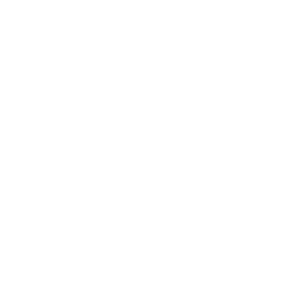

# Projeto Portfólio 

### Foi colocado em práticas todo o conteúdo aprendido de HTML e CSS.

### Foi desenvolvido a prototipação no Figma, sendo utilizadas como base para o desenvolvimento do portfólio.

